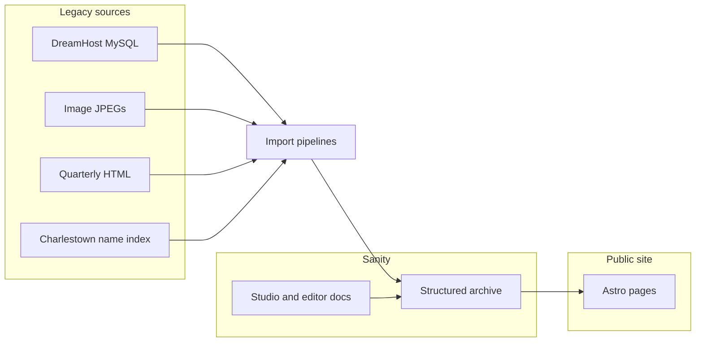

# Tredyffrin Easttown Historical Society

## Content Archive and Public Website Proposal

**Prepared for:** Tredyffrin Easttown Historical Society  
**Subject:** Completing the Sanity archive and launching a public website for the Document Collection, Image Collection, History Quarterly, and township / research pages  
**Status:** Scope for board review; fees in a separate schedule  
**Date:** August 2026

This document describes the remaining programme of work. It is not a contract. Fees, day rates, and payment dates will be confirmed in a separate schedule.

---

## 1. Purpose and executive summary

The Society’s digital collections currently live in several places: DreamHost MySQL databases, JPEG files on the2nomads.site, the History Quarterly HTML archive on tehistory.org, and standalone research pages. Volunteers cannot edit that material in one place, and the public cannot search it as a single catalog.

This programme finishes the move of those collections into **Sanity Studio** — a single editorial workspace already structured around The Archive, The Website, and Taxonomies & Entities — and publishes a fast, searchable **Astro** public site for the collections this Studio already models.

The public site will cover:

- The **Document Collection** (clippings, letters, transcriptions)
- The **Image Collection** (cataloged photographs with provenance and rights)
- The **History Quarterly Digital Archives** (volume indexes and articles)
- **Township / research pages** (modern overviews with optional map embeds)

Existing Quarterly and archive URLs will be redirected so published links keep working.

**What the Society gains**

- One catalog instead of several disconnected databases and HTML trees
- People, places, properties, and subjects linked across clippings, photographs, and Quarterly articles
- A volunteer-friendly Studio, with task-based documentation already in the workspace
- Faster public pages and standard search metadata (title, description, Open Graph, sitemap)
- An auditable migration: every import can be dry-run first and leaves exception reports for editors

---

## 2. Current situation

tehistory.org already tells visitors that several sections are “in transition to a new platform.” Those sections, and the systems behind them, are the starting point for this work.

| Collection | Where it lives today | Notes |
| --- | --- | --- |
| History Quarterly Digital Archives | tehistory.org HTML (volumes 1–44); PDF from volume 45 | HTML volumes are in scope for this engagement. Volume 45+ PDF conversion is a later increment. |
| Image Collection | DreamHost MySQL (`tehsimages2`) and JPEGs at the2nomads.site | Public JPEGs are imported. Database BLOB columns are not. |
| Document Collection | Legacy MySQL / CSV export (clippings, transcriptions, short illustrated articles) | Mapped into Primary Sources and Research Articles. |
| Donation / accession records | Legacy donations export | Imported first so photographs can link to the gift they belong to. |
| Township / research pages | Static pages and illustrated articles | Become Research Articles, with maps as embeds where already modeled. |
| Charlestown landowner index | the2nomads.site name index | About 2,500 person stubs to seed Historical Persons — not a rebuild of the Charlestown map archives. |

Studio and editor documentation already deploy together. The new public website is a separate Astro frontend that reads from the same Sanity content.

---

## 3. Proposed architecture

Legacy sources are extracted, transformed, and loaded into Sanity. Volunteers edit in Studio. The Astro site reads published content and renders the public collections.

Studio and its documentation already run on Cloudflare Workers. The Astro site is the new public frontend for the collections listed in this proposal.

---

## 4. Content model

Editors will not work with generic “databases.” They will use the same three sections already in Studio.

### The Archive

Historical media the Society is preserving.

| Type | Use |
| --- | --- |
| Primary Sources | One clipping, letter, or notice, with optional scan and transcription |
| Historical Images | One photograph, with caption, rights, provenance, and optional donation link |
| Donations | An accession or gift record — what was given, by whom, and when |

### The Website

Material written or digitized for the public site.

| Type | Use |
| --- | --- |
| Research Articles | Long-form modern research, township overviews, and pages that may include maps |
| TEHS Quarterly Articles | Digitized Quarterly text, volume / issue / page metadata, and canonical tehistory.org URLs |

### Taxonomies and Entities

Created once and linked from many archive or website documents.

Townships, Locations, Historical Persons, Families / Lineages, Properties & Buildings, Deeds & Land Instruments, Organizations, Subject Categories, Donation Categories.

Township history is not a fifth database. It is Research Articles plus these linked records.

---

## 5. Scope of work

The Studio, content model, editor guide, and import tooling are already in place. This engagement does not start from a blank CMS. It completes migration, proves the data, builds the public site, and hands the system over.

### Already in place

- Document types, Studio desk, Archive IDs, and structured rich text (including Quarterly original-page markers and research-article map embeds)
- Task-based editor documentation inside Studio
- Import scripts that default to dry-run: documents, donations, images, Quarterly HTML, and Charlestown people
- Exception reports for editors (imported, skipped, needs-manual-links, missing taxonomies, asset errors)

### Remaining phases

| Phase | Outcome |
| --- | --- |
| **A. Complete migration** | Production imports in order: donations, then images, then documents; Quarterly HTML independently; Charlestown person stubs; taxonomy links; editor exception lists |
| **B. Integrity audit** | Record-count checks, broken image URLs, missing Archive IDs, broken references, canonical Quarterly URLs |
| **C. Astro public site** | Templates and routes for the page types in section 6; search metadata; preview against Studio |
| **D. Launch and handover** | Production deploy, redirects from tehistory.org paths, volunteer walkthrough using the existing Studio docs |

**Import order.** Donations first (so photographs can link to gifts), then images, then documents. Quarterly HTML can run at any time. HTML volumes are imported in this engagement; volumes 45 and later remain PDF on the public site until a follow-on conversion is agreed.

---

## 6. Public website (in scope)

The Astro site will publish four kinds of page, all driven by Studio content.

| Page type | What the public sees |
| --- | --- |
| Quarterly archive | Volume indexes and article pages. Original print page breaks are preserved. Each article keeps its canonical tehistory.org URL for redirects. |
| Image collection | Search and viewer by subject, township, Archive ID, caption, and rights. |
| Document library | Primary sources with transcription and scan, searchable by the same taxonomies. |
| Research / township history | Research Articles as public pages, including optional map embeds already stored in Studio. |

The site will include standard search preparation: page titles, descriptions, Open Graph tags, and a sitemap. Editors will be able to preview a page from Studio before it is public.

This is not a redesign of the current tehistory.org homepage, membership, events, or store.

---

## 7. Out of scope / later phases

The following remain on tehistory.org (or in Studio only) unless agreed as a follow-on:

| Item | Why it is separate |
| --- | --- |
| Tredyffrin History Digital Archives | Interactive maps, tax and census returns, roads, and related research tools |
| Charlestown History Digital Archives | Same class of interactive archive; this engagement only seeds person stubs from the landowner index |
| Easttown Deed History public research UI | Deed records remain in Studio for linking; the public deed-history site is not rebuilt here |
| Aerial / high-resolution tiling viewers | Not part of the current image schema |
| MySQL BLOB columns (`psImages`) | Out of scope; public JPEGs are the source for Historical Images |
| tehistory.org homepage chrome | Membership, events, store, and the current home layout |
| Sanity Cloud subscription | Recurring vendor cost paid by the Society, separate from this work |

Anything in this section is a change request, not an implied deliverable.

---

## 8. Timeline and milestones

Dates will be set when the fee schedule is agreed. The sequence is fixed.

| Milestone | Status | Description |
| --- | --- | --- |
| **M1** Foundation | Complete | Content model, Studio, editor documentation, hosting for Studio |
| **M2** Pipelines and staging dry-runs | In progress | Import scripts, sample dry-runs, exception report format |
| **M3** Full import and QA | Remaining | Phase A production imports and Phase B integrity audit |
| **M4** Astro public site | Remaining | Phase C templates, routes, search metadata, preview |
| **M5** Launch and training | Remaining | Phase D production deploy, redirects, volunteer handover |

M1 and M2 are not re-quoted as greenfield work.

---

## 9. Assumptions, Society responsibilities, and risks

**Assumptions**

- Read-only access to DreamHost MySQL continues for export and verification.
- Public JPEG URLs on the2nomads.site remain fetchable for image import.
- tehistory.org Quarterly HTML remains available for snapshot and import.
- The Society can appoint editorial reviewers for exception lists.

**Society responsibilities**

- Confirm a staging dataset and a limited live sample before full import (for example, a handful of images and one Quarterly volume).
- Review `needs-manual-links` rows and suspected-duplicate people; decide merges and missing taxonomy terms.
- Own DNS and redirect rules for tehistory.org paths.
- Provide a named contact for launch week.

**Risks**

- Quarterly HTML converted from older typewritten issues still contains residual typos; import preserves text, it does not proofread it.
- DreamHost sometimes varies responses by browser identity; the importer already sends a browser-like request, but some URLs may still fail and land on an asset-error report.
- Volumes 45+ stay as PDF until a later conversion is scoped.
- Some image rows may lack a working public JPEG path; those are reported, not silently dropped.
- Taxonomy quality depends on volunteer review time after the automated link pass.

---

## 10. Commercial terms

Fees and day rates will be confirmed in a **separate schedule**. This proposal does not set a price.

**How the work is charged**

- Payment is aligned to remaining milestones **M3, M4, and M5**.
- It is not charged per record, per photograph, or per collection. Import effort is in the pipelines and the audit, not in the number of rows a finished script can process.

**Included in this engagement**

- Use of the existing Studio and editor documentation
- Remaining production imports and exception reports (Phase A)
- Integrity audit (Phase B)
- Astro public site as scoped in section 6 (Phase C)
- Production deploy, redirects, and volunteer walkthrough (Phase D)

**Not included**

- Anything listed in section 7, unless added by change control
- Sanity Cloud, Cloudflare, and domain renewals (Society costs)
- Ongoing editorial cataloging after handover

**Change control**

New collections, aerial viewers, PDF Quarterly conversion, or a rebuild of the interactive map archives will be estimated separately before work starts.

---

## 11. Next steps

1. Confirm this scope, including the out-of-scope list in section 7.
2. Confirm the fee schedule and payment alignment to M3 / M4 / M5.
3. Agree the staging dataset and a limited live sample (images and one Quarterly volume) before full import.
4. Run the sample, review exception reports together, then proceed to M3.

---

## Appendix: technical notes

These notes are for the Society’s technical volunteers. They are not required to read the proposal.

- **Sanity** stores structured documents and assets. Studio is the editing application. The public Astro site queries published content; it does not replace Studio.
- **Portable Text** is the structured rich-text format used for transcriptions, research articles, and Quarterly bodies. Quarterly “Page N” markers are stored as page-break blocks so the public site can show original pagination without breaking reading flow.
- **Archive IDs** are the natural keys from legacy `clipID` / image `identifier` values. Imports upsert on those keys so a re-run updates rather than duplicates.
- **Quarterly `sourceKey`** is the URL stem (for example `v22n1p003`). It is the join to the canonical tehistory.org article URL used for QA and redirects.
- **Image import** fetches JPEGs from `https://www.the2nomads.site/TEHSImageDatabase/` plus the stored relative path. Existing Studio image files are not re-uploaded. MySQL `psImages` BLOBs are not read.
- **Import reports** are written per run (`imported`, `skipped`, `diverted-quarterly`, `needs-manual-links`, `missing-taxonomies`, `asset-errors`, `summary`). Dry-run is the default until `--live` is passed.
- **Studio hosting** is already a Cloudflare Worker that serves Studio and the editor documentation together. The Astro site is a new deployable.
