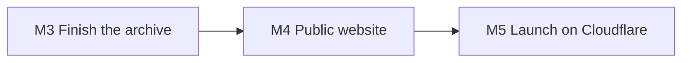

# Tredyffrin Easttown Historical Society

## Website rebuild — programme brief

**Prepared for:** Board of Directors and officers  
**Subject:** Replacing tehistory.org with one public site, edited in Studio, hosted on Cloudflare  
**Status:** Scope for board review; fees in a separate schedule  
**Date:** September 2026  
**Companion:** Engineering detail is in [tehs-website-rebuild-prd.md](./tehs-website-rebuild-prd.md). This brief does not set a price.

This document is not a contract. Fees, day rates, and payment dates stay in the separate commercial schedule.

---

## 1. Outcome

Visitors will use **one website** at tehistory.org for Society news, membership, the History Quarterly, photographs, documents, research pages, and searchable deed histories. Volunteers will edit that material in the Studio they already use. Published links on the old HTML pages will redirect so bookmarks and citations keep working.

The site will run on **Cloudflare** (the same account that already hosts Studio). Membership dues and back-issue sales stay on **PayPal**. Meeting notices and the email list stay on **Mailchimp**. The email list remains **free**; it is not a second paid product next to membership and the printed Quarterly.

---

## 2. What people will be able to do

- Find a History Quarterly article by volume, author, or subject, and read the digitized text (HTML volumes) or open the issue PDF (later volumes).
- Search the photograph catalog by place, subject, caption, and Archive ID.
- Read a clipping or letter with its transcription and scan.
- Open a modern research or township page, including Then & Now landmark comparisons.
- Follow a chain of title for an Easttown (then Tredyffrin / Charlestown) tract without using the old map sites.
- See the next public meeting, join or renew, buy a back issue, and sign up for email notices.
- Contact the Society and find the board, sponsors, and related organizations.

---

## 3. In scope / later

### In this programme

| Item | What “done” means |
| --- | --- |
| Finish moving collections into Studio | Documents imported; photograph leftovers cleaned; Quarterly HTML bodies for volumes 1–44; deed rows imported as searchable records |
| Public website | Full replacement of tehistory.org: Home, About, News, Membership, Contact, Publications, store, sponsors, collections, Then & Now, deed search |
| Hosting | tehistory.org served from Cloudflare; old `.html` addresses redirect |
| Payments and email | Existing PayPal buttons and Mailchimp signup on the new pages |

### Out of scope (later increments)

| Item | Why it waits |
| --- | --- |
| Interactive historic map viewers (THDA, Easttown, Charlestown year-maps) | Deed *records* ship first; polygon / year-toggle maps are a separate product |
| Aerial / high-resolution tiling viewers | Not in the current photograph schema |
| MySQL image BLOB columns | Public JPEGs are the source; database blobs are not copied |
| History Quarterly volumes 45+ as HTML | Those issues stay PDF until a conversion is agreed |
| Switching PayPal or Mailchimp | Changing payment or email rails during a hosting move risks dues and the list |
| A paid newsletter | Membership and the printed Quarterly are already the paid relationship |
| Sanity Cloud, Cloudflare, and domain renewals | Society vendor costs, not this work |

Anything in the later table is a change request, not an implied deliverable.

---

## 4. Already done

The Society is not starting from a blank CMS.

- Studio, the content model, and in-Studio editor documentation are live on Cloudflare.
- Donation / accession records are in (119 gifts).
- Most cataloged photographs are in (thousands of public JPEGs, with a leftover cleanup list).
- History Quarterly issues are cataloged (covers, volume and number). Article text is piloted; most HTML volumes still need their bodies imported.
- About 2,600 Charlestown landowner names exist as person records.
- Deed / property types exist in Studio; the Easttown / Tredyffrin / Charlestown title chains are **not** imported yet.
- Only a sample of the Document Collection is in Studio. The rest of the legacy export is ready to import.

---

## 5. Phases and “done when”

Dates will be set when the fee schedule is agreed. The sequence is fixed. Home and Society pages can go live on Cloudflare while document and deed imports continue.

### M3 — Finish the archive

Outcome: the collections this site will publish are in Studio and checked.

- Document Collection production import is done and exception lists have been reviewed.
- Photograph leftovers (failed downloads, missing subjects) are either fixed or recorded as not importable.
- Quarterly HTML bodies for volumes 1–44 are in; volumes 45+ remain PDF.
- Easttown deed histories are imported as properties and conveyances (Tredyffrin and Charlestown chains follow). Interactive maps are not part of this phase.
- An integrity check has been run (counts, broken images, missing Archive IDs, Quarterly URLs for redirects).

### M4 — Public website

Outcome: a public Astro site reads published Studio content and covers the current tehistory.org jobs.

- Visitors can use Home, About, News, Membership, Contact, Publications, store, and collections without the old HTML layout.
- Editors can change those pages in Studio without a website deploy (menus stay editor-only).
- PayPal and Mailchimp work from the new pages. Email signup is free; there is no paid newsletter.
- Search metadata (title, description, sharing image, sitemap) is in place. Studio preview is available before publish.

### M5 — Launch on Cloudflare

Outcome: tehistory.org is the new site. Old addresses redirect. Volunteers can run the system.

- DNS for the public site points at Cloudflare; **incoming email still works** (mail records copied before any nameserver change).
- Legacy paths such as `index.html` and Quarterly HTML addresses redirect to the new pages.
- DreamHost is left running until leftover MySQL and JPEG files are no longer needed.
- A volunteer walkthrough has been given using the existing Studio documentation.

**Definition of done (every phase):** content for that slice is in Studio; named public pages render it; listed old URLs redirect; editors can update the slice without a deploy.

---

## 6. Hosting, payments, and email (board decisions)

**Hosting.** Move the *website* from DreamHost shared hosting to Cloudflare, where Studio already lives. Keep the domain registered where it is until launch is stable. Do not delete the old site until redirects have been watched for a week. A named officer must have DreamHost and Cloudflare login, and must confirm where `info@` and `membership@` actually arrive **before** DNS changes.

**Payments.** Keep PayPal for membership and the Quarterly store, and keep mail-in checks. Switching to Stripe or a fundraising platform during the rebuild would retrain volunteers and risk renewals for no visitor-facing gain. In-person card readers (for Community Day) can stay a separate, later choice.

**Email.** Keep Mailchimp for the public list unless the treasurer finds the bill or contact limit unacceptable — then Kit is the fallback. The new site will still offer signup. Send when there is a meeting or a new Quarterly, not on a forced monthly calendar unless an officer owns that cadence.

**No paid newsletter.** Household membership and the printed Quarterly are the paid products. A second paid email would compete with dues and confuse benefits. A later “members” tag on the same Mailchimp list (renewal reminders) is a membership benefit, not a new subscription.

---

## 7. Society responsibilities

- Appoint a **named launch contact** with DreamHost, Cloudflare, PayPal, and Mailchimp access.
- Confirm a staging look at the new site before the public switch.
- Review import exception lists (missing places, duplicate people, photographs with no file).
- Own DNS and the decision to switch nameservers only after mail records are copied.
- Keep composing the email list in Mailchimp; name who sends it.
- Continue PayPal and mailed-check membership as today.

---

## 8. Next steps

1. Confirm this scope, including the later-increments table in section 3.
2. Confirm the fee schedule aligned to M3, M4, and M5.
3. Review the new site on a staging address, then agree the Cloudflare switch date.
4. Proceed with remaining imports and the public pages in parallel as in section 5.

Engineering requirements, page-by-page acceptance criteria, and the old-URL map are in the [product requirements document](./tehs-website-rebuild-prd.md).
