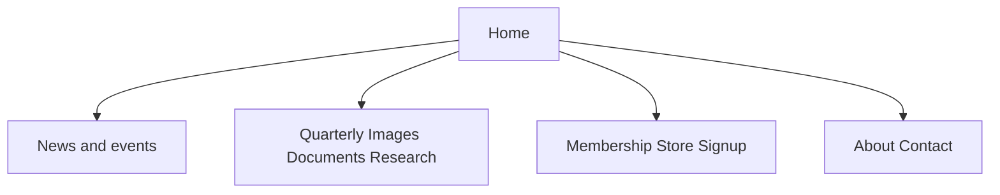

# TEHS website rebuild — product requirements

**Readers:** implementers (Studio schemas, Astro routes, imports, Cloudflare).  
**Board summary:** [tehs-website-rebuild-brief.md](./tehs-website-rebuild-brief.md).  
**Fees:** not in this document.  
**Date:** September 2026  
**Product:** full replacement of [tehistory.org](https://www.tehistory.org/) on Cloudflare, content from Sanity.

A builder should implement a route from a page spec without reverse-engineering the legacy HTML. Do not put PayPal secrets or commercial rates in this file.

---

## 1. Problem, users, jobs

**Problem.** Society news, membership, the History Quarterly, photographs, documents, and township research live on disconnected HTML trees and MySQL apps. Volunteers cannot edit them in one place. Visitors cannot search them as one catalog. tehistory.org already says several sections are “in transition to a new platform.”

| User | Job to be done |
| --- | --- |
| Public researcher | Find an article, photograph, clipping, or deed chain without knowing the old URL |
| Member / resident | See the next meeting, join or renew, buy a back issue, sign up for notices |
| Volunteer editor | Catalog a clipping or photograph and have it appear on the public site after publish |
| Officer | Update News, board list, membership copy, and menus without a deploy |

---

## 2. Goals and non-goals

**Goals**

- One public site at `tehistory.org` / `www.tehistory.org` covering Society chrome and collections.
- Studio is the CMS. Astro (separate repo) renders published content. No PHP origin for the new site.
- Legacy HTML and HQDA URLs redirect. Subdomain archives (`images.`, `documents.`, `thda.`, `easttown.`, `charlestown.`) redirect or reverse-proxy until their content is on the new routes.
- PayPal and Mailchimp keep working. Email list stays **free**.
- Search, titles, descriptions, Open Graph, sitemap, and JSON-LD on public pages.

**Non-goals (v1)**

- Interactive THDA / Easttown / Charlestown **map UIs** (year toggles, polygons). Import deed *records*; maps are later (`historicMap`).
- Aerial tiling viewers.
- MySQL `psImages` BLOBs.
- HTML conversion of Quarterly volumes 45+.
- Replacing PayPal or Mailchimp in the same window as DNS.
- Hosting video in Sanity (`file` or Media Library). YouTube/Vimeo URLs only.
- Cloudflare Email Sending as a newsletter tool (transactional contact receipts only, later).
- A paid newsletter or Substack/Beehiiv.
- One Sanity type per legacy HTML file.
- Cloning the 2006 table layout.

---

## 3. Information architecture

Do not clone the current table chrome. Header stays short (Studio warns above 6 items, errors above 8).

**Header:** Home, News, Quarterly, Images, Membership, Search (kind `search` → `/search`).

**Explore / footer:** About, Documents, Research, Then & Now, Places, People, Subjects, Contact, Store, Support.

### Legacy URL → route → slice

| Legacy | New route | Slice |
| --- | --- | --- |
| `index.html` | `/` | Shell |
| `about.html` and subpages | `/about` | Shell |
| `contact.html` | `/contact` | Shell |
| `links.html` | `/links` | Shell |
| `news.html`, `news.html#ov` | `/news`, `/events/[slug]`, `/awards` | Operations |
| `membership.html` | `/membership` | Operations |
| `support.html` | `/support` | Operations |
| `sponsors.html` | `/sponsors` | Operations |
| `hqstore.html` | `/store` | Operations |
| `pubs.html` | `/publications` | Operations |
| `archives.html` | `/archives` | Operations |
| `signup.html` | `/signup` (also footer embed) | Operations |
| `homepix.html` | `/` featured images (no slideshow app) | Shell |
| `tnindex.html` | `/then-and-now`, `/then-and-now/[slug]` | Collections |
| `hqda/qtoc2.html`, `qtoc1.html`, `/hqda/toc/qvNNtoc.html` | `/quarterly`, `/quarterly/v{n}` | Collections |
| `/hqda/.../{sourceKey}.html` | `/quarterly/{sourceKey}` | Collections |
| `images.tehistory.org` | `/images`, `/images/[archiveId]` | Collections |
| `documents.tehistory.org` | `/documents`, `/documents/[archiveId]` | Collections |
| `search.html` | `/search` | Shell |
| `easttown.tehistory.org` | `/deeds`, `/properties/[id]` | Deeds |
| `thda.tehistory.org` | `/research` essays + `/deeds` (maps later) | Deeds / later |
| `charlestown.tehistory.org` | `/deeds` + `/people` (maps later) | Deeds / later |

---

## 4. Content model

Content is data, not pages. One `societyEvent` feeds Home “next meeting”, `/news`, and the video list.

### Existing types (reuse)

`primarySource`, `historicalImage`, `donation`, `donationCategory`, `researchArticle`, `thenAndNow`, `quarterlyIssue`, `quarterlyArticle`, `siteNavigation`, `person`, `familyLine`, `property`, `deed`, `business`, `organization`, `county`, `township`, `location`, `category`.

Objects: `historicalDate`, `mapEmbed`, `historicalImageEmbed`, `pageBreak`, `thenAndNowView`, `navLink`.

### Types to add (v1 chrome)

Do not create one type per HTML file. Living officers are **not** `person`.

| Type | Kind | Fields (minimum) | Role |
| --- | --- | --- | --- |
| `siteSettings` | singleton id `siteSettings` | `postalAddress`, `emails[]` (purpose + address), `facebookUrl`, `twitterUrl`, `mailchimpEmbedUrl`, `privacySentence` | Contact + signup + social |
| `homePage` | singleton id `homePage` | `intro` (Portable Text), optional `heroImage` → `historicalImage`, optional `noUpcomingEventNote` | Welcome copy only |
| `sitePage` | document + `slug` | `title`, `slug`, `body` (PT), optional `files[]` | About, membership copy, donate, archives, collecting policy, store shipping, publications intro |
| `societyEvent` | document + `slug` | `title`, `slug`, `kind`, `startAt`, optional `endAt`, `venue`, `speaker`, `body`, `videoUrl` (YouTube/Vimeo only) | Meetings, exhibits, talks |
| `societyOfficer` | document | `name`, `role`, `sortOrder`, optional `photo`, `exOfficio` | Living board |
| `membershipTier` | document | `name`, `slug`, `price`, `paypalItemId`, `benefits`, `sortOrder` | Household / Patron |
| `relatedLink` | document | `title`, `url`, optional `notes` | `/links` |
| `sponsor` | document | `name`, `blurb`, optional `logo`, `url`, `sortOrder` | `/sponsors` |
| `salesOutlet` | document | `name`, `address`, optional `hoursNote`, `sortOrder` | `/publications` distributors |
| `award` | document | unique `year`, `recipients[]` (`name`, flags, optional `photo`, `notes`) | Teamer awards |

Singletons: hide from Create; block duplicate/delete; same edit roles as `siteNavigation` (Administrator, Editor, Developer).

### Fields to add on existing types

On `quarterlyIssue`: `forSale` (boolean), `price` (number), `paypalItemId` (string). Shipping copy lives on `sitePage` slug `store`.

### Later types (not v1)

`historicMap`, `taxAssessment`, `newsletterIssue`.

### Modelling rules

- Deed row → `deed`. Transcribed scan → `primarySource` via `deed.scanSource`. CSV type `deed history` on document import stays `primarySource` (clippings *about* deeds), not Easttown title chains.
- Publications TOC is queried from issues/articles, not stored on a static pubs page.
- Video: URL string only.

---

## 5. Workstreams and slices

| Workstream | Produces | Depends on |
| --- | --- | --- |
| Migration | Documents, Quarterly bodies, deed rows | Existing pipelines in this repo |
| Schema | Chrome types above | This PRD |
| Frontend | Astro app (separate repo) | Schema + published content |
| Cutover | Cloudflare DNS, Worker, Redirect Rules, MX preserved | Staging hostname |

**Astro slices** (each publicly usable):

1. **Shell** — `siteSettings`, `siteNavigation`, Home, About, Contact, Links
2. **Society operations** — News/events, Membership, Donate, Sponsors, store
3. **Collections** — Quarterly, Images, Documents, Research, Then & Now, Places, People, Subjects
4. **Deed search** — after Easttown import
5. **Later** — maps, aerials, PDF Quarterly HTML

Do not block slice 1 on finishing document import.

**Definition of done (each slice):** Studio content exists for that slice; named routes render published docs; redirect table entries for those routes resolve; editors update without a deploy (nav and other singletons remain Administrator/Editor/Developer).

---

## 6. Page specs

Every spec uses: route, legacy URL(s), types, must / must not, empty/error, acceptance, slice.

### `/` Home

- **Legacy:** `index.html`, `homepix.html`
- **Types:** `homePage`, `siteNavigation`, next `societyEvent` (soonest `startAt` in the future), featured `historicalImage` / `researchArticle` / `thenAndNow`
- **Must:** next-meeting teaser; paths into Quarterly / Images / Documents / Research; Mailchimp in footer or a module; skip-link to content
- **Must not:** PayPal cart chrome; duplicate TOC of the current Quarterly (link to `/publications` or the current issue)
- **Empty / error:** no future event → omit teaser unless `homePage.noUpcomingEventNote` is set. No featured images → omit the grid, do not show broken tiles.
- **Acceptance:** Given a published future event, Home shows title, date, and venue. Featured images use catalog files, not anonymous uploads. Header Search is a field, not a sixth text link.
- **Slice:** Shell

### `/about`

- **Legacy:** `about.html` (Objectives / Get Involved copy folds into this page or anchors on the same `sitePage`)
- **Types:** `sitePage` slug `about`; `societyOfficer` list ordered by `sortOrder`
- **Must:** 501(c)(3) sentence; board names and roles
- **Must not:** historical `person` documents used as living officers
- **Empty / error:** empty board → hide the heading; page body still renders
- **Acceptance:** Publishing a new officer appears after the next build/ISR. Role text matches Studio.
- **Slice:** Shell

### `/contact`

- **Legacy:** `contact.html`
- **Types:** `siteSettings`
- **Must:** postal address; purpose emails (info, membership, archives, quarterly, board, webmaster)
- **Must not:** a mailbox or inbox stored in Sanity
- **Empty / error:** missing email row is omitted; address is required in Studio
- **Acceptance:** each purpose email is a `mailto:` link; address matches `siteSettings`
- **Slice:** Shell

### `/links`

- **Legacy:** `links.html`
- **Types:** `relatedLink`
- **Must:** title + outbound URL; `rel="noopener noreferrer"`
- **Must not:** crawled as the Society’s own research essays
- **Empty / error:** empty list → “This list is being updated.”
- **Acceptance:** sorted by title; every item is an external `https` link
- **Slice:** Shell

### `/news` and `/events/[slug]`

- **Legacy:** `news.html`
- **Types:** `societyEvent`
- **Must:** upcoming list, past list; optional YouTube/Vimeo embed from `videoUrl`
- **Must not:** Sanity-hosted video files
- **Empty / error:** no upcoming events → past list still shows. Unknown slug → 404. Invalid `videoUrl` → no player
- **Acceptance:** `startAt` in the future → Upcoming; in the past → Past. Detail page title matches the event
- **Slice:** Operations

### `/awards`

- **Legacy:** `news.html` Teamer section
- **Types:** `award`
- **Must:** year and recipient names
- **Must not:** require a photo to list a recipient
- **Empty / error:** years with no award (2017, 2022) are simply absent
- **Acceptance:** years descending; posthumous / deceased flags render if set
- **Slice:** Operations

### `/membership`

- **Legacy:** `membership.html`
- **Types:** `sitePage` slug `membership`; `membershipTier`; `paypalItemId` on each tier; mail-in address from `siteSettings`
- **Must:** Household and Patron; PDF application if editors attach a file on the `sitePage`; check/mail instructions
- **Must not:** card fields on tehistory.org; Astro must not see PayPal secrets
- **Empty / error:** tier without `paypalItemId` → show price and mail-in only, no Join button
- **Acceptance:** Join opens PayPal (hosted button or link). Check instructions remain visible
- **Slice:** Operations

### `/support`

- **Legacy:** `support.html`
- **Types:** `sitePage` slug `support`
- **Must:** 501(c)(3) giving copy from Studio
- **Must not:** reuse `donation` (that type is accession/gift catalog)
- **Empty / error:** unpublished page → 404
- **Acceptance:** body is Portable Text from Studio, not hardcoded
- **Slice:** Operations

### `/sponsors`

- **Legacy:** `sponsors.html`
- **Types:** `sponsor`
- **Must:** name and blurb
- **Must not:** require a logo
- **Empty / error:** empty list → short thank-you from a `sitePage` or omit the grid
- **Acceptance:** optional logo; optional outbound URL
- **Slice:** Operations

### `/store`

- **Legacy:** `hqstore.html`
- **Types:** `quarterlyIssue` where `forSale == true`; `sitePage` slug `store` for shipping copy
- **Must:** price and PayPal only when `forSale` and `paypalItemId` are set
- **Must not:** a parallel product catalog; hardcoded shipping numbers in the template
- **Empty / error:** no for-sale issues → shipping copy still shows; empty cart state is PayPal’s, not ours
- **Acceptance:** “current issue included with membership” comes from the store `sitePage`
- **Slice:** Operations

### `/publications`

- **Legacy:** `pubs.html`
- **Types:** `sitePage` slug `publications`; current `quarterlyIssue`; `salesOutlet`; articles in that issue
- **Must:** generated TOC; distributor list
- **Must not:** a hand-maintained TOC field that duplicates articles
- **Empty / error:** no current issue flagged → intro copy still renders; TOC omitted
- **Acceptance:** TOC is `quarterlyArticle` + `thenAndNow` for the current issue, ordered by start page
- **Slice:** Operations

### `/archives`

- **Legacy:** `archives.html`
- **Types:** `sitePage` (intro; collecting policy may be the same slug with a heading or slug `collecting-policy`)
- **Must:** optional PDF files (catalogue, finding aids, book list)
- **Must not:** treat accession `donation` records as the archives narrative
- **Empty / error:** no PDFs → page still readable
- **Acceptance:** files download with editor-set labels
- **Slice:** Operations

### `/signup`

- **Legacy:** `signup.html`
- **Types:** `siteSettings.mailchimpEmbedUrl`, `privacySentence`
- **Must:** double opt-in copy; privacy sentence; Mailchimp unsubscribe (platform)
- **Must not:** store subscribers in Sanity; paid-tier signup
- **Empty / error:** missing embed URL → show address/email fallback, no fake form
- **Acceptance:** submitting uses Mailchimp, not a Studio document
- **Slice:** Operations

### `/quarterly` and `/quarterly/[sourceKey]`

- **Legacy:** `hqda/*`, `qtoc1.html`
- **Types:** `quarterlyIssue`, `quarterlyArticle`
- **Must:** volume index; article body with `pageBreak`; canonical path from `sourceKey`
- **Must not:** invent HTML for volumes 45+ (PDF on the issue is enough)
- **Empty / error:** stub without body → title, author, pages, and PDF if present. Unknown `sourceKey` → 404
- **Acceptance:** `v22n1p003` is reachable at `/quarterly/v22n1p003`. Volume index lists issues in number order
- **Slice:** Collections

### `/images` and `/images/[archiveId]`

- **Legacy:** `images.tehistory.org`
- **Types:** `historicalImage` (+ filters via `township`, `category`)
- **Must:** caption, rights, photographer on detail; filters on index
- **Must not:** images that were never imported (`publicDisplay=N`)
- **Empty / error:** no filter matches → explicit empty state. Unknown Archive ID → 404
- **Acceptance:** filter by township and subject; image from Sanity CDN
- **Slice:** Collections

### `/documents` and `/documents/[archiveId]`

- **Legacy:** `documents.tehistory.org`
- **Types:** `primarySource`
- **Must:** title, date, transcription and/or scan when present
- **Must not:** treat book-length research as this type (`researchArticle`)
- **Empty / error:** empty transcription → metadata and scan still show
- **Acceptance:** Archive ID in the URL matches Studio `archiveId`
- **Slice:** Collections

### `/research` and `/research/[slug]`

- **Legacy:** township / illustrated articles (static pages)
- **Types:** `researchArticle`
- **Must:** Portable Text body; map embeds when stored
- **Must not:** use this type for a single clipping
- **Empty / error:** unpublished slug → 404. Broken `mapUrl` → caption/fallback, no blank iframe
- **Acceptance:** map embeds in a sandboxed iframe; internal sub-links resolve to other research slugs
- **Slice:** Collections

### `/then-and-now` and `/then-and-now/[slug]`

- **Legacy:** `tnindex.html`
- **Types:** `thenAndNow`
- **Must:** Then and Now photographs with commentary; issue citation
- **Must not:** implement as a Research Article or Quarterly Article
- **Empty / error:** missing one view → still show the other with a note
- **Acceptance:** index lists title + township; detail shows both views
- **Slice:** Collections

### `/places`, `/people`, `/subjects`

- **Legacy:** none as top nav on tehistory.org (new Explore)
- **Types:** `township` / `location`; `person` with public incoming refs only; `category`
- **Must:** A–Z indexes that link to filtered collections
- **Must not:** list Charlestown person stubs with no public incoming links
- **Empty / error:** a person with no public links is omitted, not 404
- **Acceptance:** Places: townships then villages. Subjects: concrete themes (not Person/Place/View catch-alls)
- **Slice:** Collections

### `/deeds` and `/properties/[id]`

- **Legacy:** `easttown.tehistory.org` (v1 search, not map)
- **Types:** `property`, `deed`, `person`
- **Must:** ordered **Title Chain**
- **Must not:** require a map to read the chain
- **Empty / error:** property with no deeds → page still shows name and place. Unknown id → 404
- **Acceptance:** grantor/grantee text or person links; dates and references as recorded
- **Slice:** Deeds

### `/search`

- **Legacy:** `search.html`
- **Types:** published `quarterlyArticle`, `historicalImage`, `primarySource`, `researchArticle`, `societyEvent`, `thenAndNow`
- **Must:** query titles (and captions where relevant)
- **Must not:** return drafts or Studio-only internal comments
- **Empty / error:** no hits → explicit empty state. Empty query → prompt, not a dump of the catalog
- **Acceptance:** results link to the canonical routes above
- **Slice:** Shell

---

## 7. Cross-cutting: SEO, redirects, a11y, performance

### SEO

| Surface | Requirement |
| --- | --- |
| Title | Unique `{page} · Tredyffrin Easttown Historical Society` (Home may omit the prefix) |
| Description | From Studio when present; else first ~160 characters of intro/body |
| Canonical | `https://www.tehistory.org{path}` (pick www or apex once; the other 301s) |
| Open Graph | `og:title`, `og:description`, `og:url`, `og:image` (featured or catalog image) |
| Sitemap | All published public routes; exclude 404s and empty filter URLs |
| robots | Allow public pages; noindex preview/draft hosts |
| JSON-LD | `Organization` on Home; `Event` on `/events/[slug]`; `Article` on Quarterly/research |

### Redirects (301)

Generate article-level HQDA rules from `quarterlyArticle.sourceKey` / `sourceUrl` at launch (do not hand-type ~1,800 rows). Operational DNS steps: [cloudflare-cutover.md](./cloudflare-cutover.md).

| Incoming | Target |
| --- | --- |
| `/index.html` | `/` |
| `/about.html` | `/about` |
| `/contact.html` | `/contact` |
| `/links.html` | `/links` |
| `/news.html` | `/news` |
| `/membership.html` | `/membership` |
| `/support.html` | `/support` |
| `/sponsors.html` | `/sponsors` |
| `/hqstore.html` | `/store` |
| `/pubs.html` | `/publications` |
| `/archives.html` | `/archives` |
| `/signup.html` | `/signup` |
| `/homepix.html` | `/` |
| `/tnindex.html` | `/then-and-now` |
| `/search.html` | `/search` |
| `/qtoc1.html`, `/hqda/qtoc2.html` | `/quarterly` |
| `/hqda/toc/qv{NN}toc.html` | `/quarterly/v{NN}` |
| `/hqda/.../{sourceKey}.html` | `/quarterly/{sourceKey}` |
| `images.tehistory.org/*` | `/images` (then per-id when mapped) |
| `documents.tehistory.org/*` | `/documents` |
| `easttown.tehistory.org/*` | `/deeds` (maps later) |

Watch 404s for seven days after cutover; add misses to this table.

### Accessibility

Semantic headings, keyboardable header and search, alt from catalog (embed override allowed), contrast on text over hero images, skip-link on Home.

### Performance

Static generation or ISR; Sanity CDN via `@sanity/image-url`; no client fetch of full catalogs on first paint.

### Preview

Studio Presentation / draft overlay against the Astro origin. Stega optional as a follow-on.

---

## 8. Integrations

| System | v1 behaviour |
| --- | --- |
| PayPal | Hosted buttons / links from `membershipTier.paypalItemId` and `quarterlyIssue.paypalItemId`. Astro never holds card data. Mail-in checks remain. |
| Mailchimp | Embed from `siteSettings`. **Free list only.** Officers compose in Mailchimp. Cadence: meeting or new issue — not a mandated monthly. |
| Facebook / Twitter | URLs on `siteSettings` |
| YouTube / Vimeo | `societyEvent.videoUrl` only |
| Cloudflare Email Sending | Out of scope for v1. Later: contact-form receipts, not bulk mail |

Do not switch PayPal or Mailchimp in the same change window as DNS.

**PayPal vs alternatives (locked):** keep PayPal. Stripe only if Apple Pay / dunning becomes a stated later requirement. Donorbox/Givebutter add a platform fee on top. Square is in-person (Community Day), not the website processor.

**Mailchimp vs alternatives (locked):** keep Mailchimp if the audience already lives there. Kit is the exit if the treasurer rejects cost or the 250-contact free cap. No Beehiiv/Substack. No paid newsletter: membership and the printed Quarterly are the paid products. Optional later: a **member** tag on the same Mailchimp audience (renewal reminders), billed through dues, not a second subscription.

---

## 9. Editorial workflow

- Archive catalogers: Primary Sources, Images, Donations. They cannot edit `siteNavigation`, `siteSettings`, or `homePage`.
- Editors / Administrators / Developers: chrome singletons, News, Membership, nav.
- Publish in Studio → public site picks up on rebuild or live query (choose one in the Astro repo; document it there).
- `internalComments` and similar Studio-only fields never render publicly.

---

## 10. Hosting / Cloudflare cutover

Checklist: [cloudflare-cutover.md](./cloudflare-cutover.md).

- **Today:** DreamHost registrar + nameservers (`ns1/2/3.dreamhost.com`); HTML site; MySQL/JPEGs on `the2nomads.site`; Studio Worker `studio-tehs-document-db`.
- **Target:** new Astro **Worker** with [Workers Static Assets](https://developers.cloudflare.com/workers/static-assets/) and **SSG** routing — not Studio’s SPA `not_found_handling`. Custom domains `tehistory.org` and `www`. Redirect Rules for the `.html` forest. Do **not** use Cloudflare Pages for a new app.
- **Must:** inventory A/AAAA/CNAME for apex, `www`, and archive subdomains; copy **MX and TXT** (SPF, DMARC, Mailchimp DKIM) before any nameserver change.
- **Must not:** delete DreamHost hosting until JPEG/MySQL leftovers are unused; use Cloudflare Email Sending as the newsletter.

**Sequence:** (1) fill DNS/MX inventory, (2) staging Worker reviewed, (3) attach custom domains, (4) switch NS **or** change only A/CNAME if MX stays on DreamHost DNS, (5) enable Redirect Rules, (6) confirm mail and a Mailchimp test send, (7) watch 404s for seven days.

---

## 11. Launch

1. Staging Worker hostname; Society review of slices 1–2.
2. Copy DNS (including MX) into Cloudflare; add the site as a custom domain (proxied).
3. Switch nameservers **or** change A/CNAME only if MX stays on DreamHost DNS.
4. Enable Redirect Rules; watch 404s for seven days.
5. Volunteer walkthrough using existing Studio docs plus chrome types.
6. Keep DreamHost billed until leftovers are gone.

---

## 12. Open questions

- Where do `info@` / `membership@` mailboxes actually live (DreamHost, Google, forward)?
- Mailchimp contact count and current plan (free vs Essentials)?
- PayPal hosted-button IDs for Household, Patron, and each for-sale issue — inventory in Studio after chrome schemas land.
- Parallel-run (`www` on Cloudflare, apex still DreamHost) vs hard cut — officer choice at M5.
- Astro live vs static rebuild cadence.

---

## 13. Suggested build order

1. Chrome schemas and singletons in this repo (from §4).
2. Astro slice 1 against those singletons.
3. `documents-full.csv` live import and exception review (does not block slice 1).
4. Quarterly HTML bodies volume-by-volume.
5. Easttown deed importer, then `/deeds`.
6. Cloudflare cutover using the runbook.
